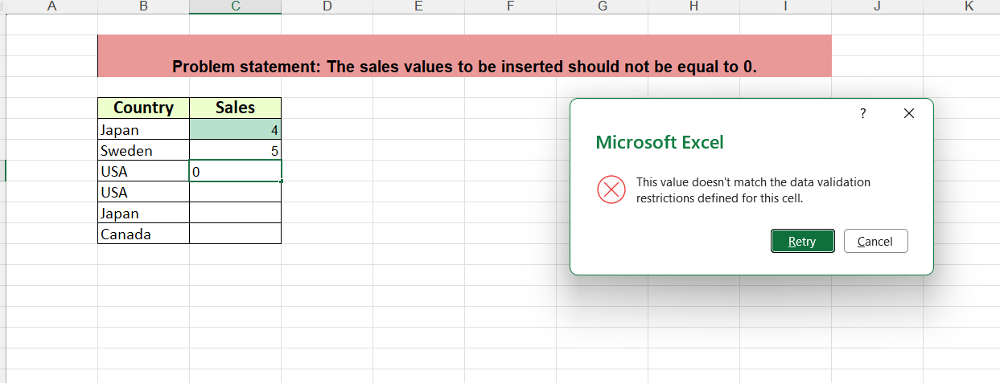

# 📊 Excel Data Validation and Conditional Formatting

## 📌 Project Overview
This project demonstrates how to improve data accuracy and visualization using Microsoft Excel.

## 🛠 Tools Used
- Microsoft Excel

## 🔍 Tasks Performed

### 1. Region Dropdown (Data Validation)
- Created dropdown list for region selection
- Ensured consistent data entry

### 2. Payment Status Validation
- Added dropdown (Paid / Unpaid)
- Prevented invalid entries

### 3. Conditional Formatting (Defense Values)
- Highlighted values below average in red

### 4. Conditional Formatting (Age Criteria)
- Highlighted age > 35 in green

### 5. Data Validation Rule (Sales ≠ 0)
- Restricted zero values
- Displayed error message

## 📸 Screenshots

### Validation Error

## 💡 Key Learnings
- Improved data quality using validation rules
- Used conditional formatting for better insights
