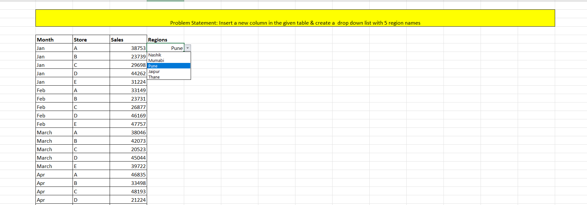
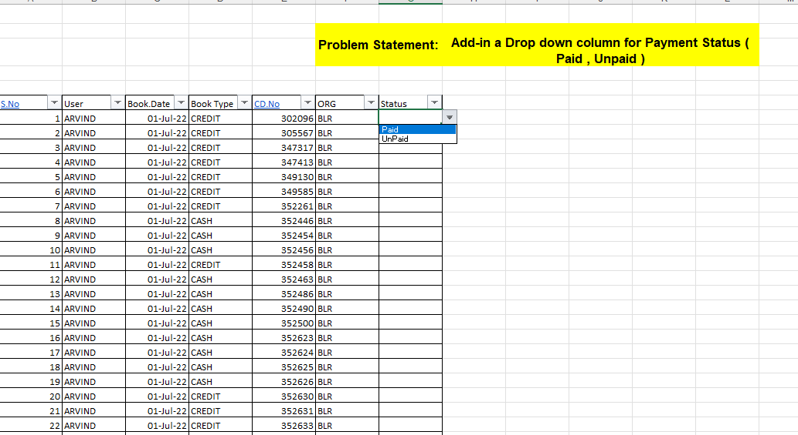
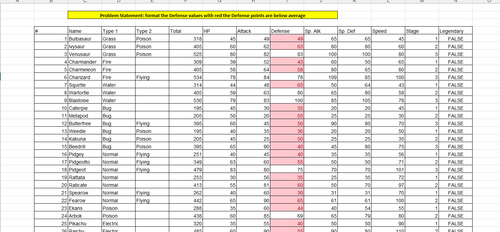
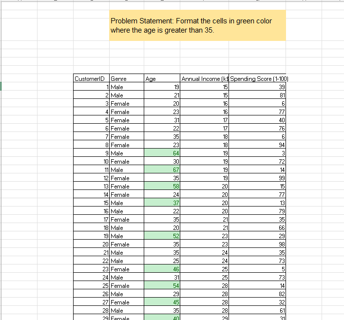

# 📊 Excel Data Validation and Conditional Formatting

## 📌 Project Overview
This project demonstrates how to improve data accuracy and visualization using Microsoft Excel. It focuses on applying data validation rules and conditional formatting to enforce business logic and highlight key insights.

## 🛠 Tools Used
- Microsoft Excel

## 🔍 Tasks Performed

### 1. Region Dropdown (Data Validation)
- Created a dropdown list with predefined region names
- Ensured consistent and controlled data entry

---

### 2. Payment Status Validation
- Added dropdown list for payment status (Paid / Unpaid)
- Prevented incorrect or inconsistent inputs

---

### 3. Conditional Formatting (Defense Values)
- Highlighted defense values below average in red
- Helped identify weak performance quickly

---

### 4. Conditional Formatting (Age Criteria)
- Highlighted age greater than 35 in green
- Enabled quick identification of target group

---

### 5. Data Validation Rule (Sales ≠ 0)
- Restricted users from entering zero values
- Displayed error message for invalid inputs

---

## 💡 Key Learnings
- Applied data validation to maintain data integrity  
- Used conditional formatting for better visualization  
- Implemented business rules in Excel  
- Improved data readability and accuracy  

---

## 🎯 Conclusion
This project showcases how Excel can be used not just for data entry, but also for enforcing data quality and generating meaningful insights.
